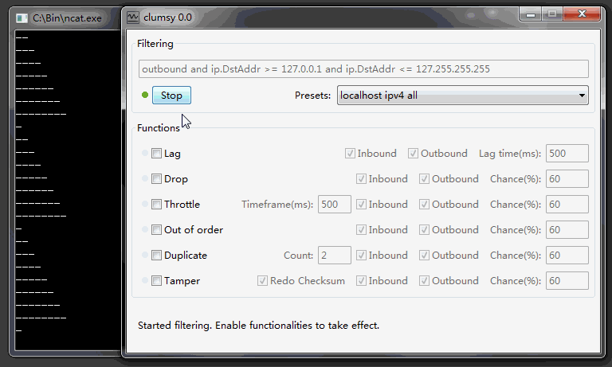

## Recent Modifications

### Latest Updates (2026)
* **Preset Switching via Keybinds** - Switch between presets on-the-fly using keyboard shortcuts:
  * `Ctrl + [keybind]` - Switch to next preset (cycles 1→2→3→4→5→1)
  * `Shift + [keybind]` - Switch to previous preset (cycles 1→5→4→3→2→1)
  * Changes apply **instantly** while filtering is active - no need to restart!
* **Major Code Refactoring** - Reduced codebase by ~1,300 lines through:
  * Consolidating duplicate handler functions into generic implementations
  * Eliminating code duplication across preset configuration functions
  * Optimizing string operations and helper functions
  * Improved maintainability and performance

### Previous Features
* **Hotkey toggles** (custom keybind) - Original implementation by [kalirenegade-dev](https://github.com/kalirenegade-dev/clumsy)
* **Function presets** - Save and set variables across 5 configurable presets
* **Updated bandwidth module** - Queue-based bandwidth limit with KB/MB toggle, based on [kuhnliu/clumsy](https://github.com/kuhnliu/clumsy)
* **Hotspot support** - Toggle local/remote, based on [abaza121/clumsy-hotspot](https://github.com/abaza121/clumsy-hotspot)
* **Disconnect** - Stop all data transmission
* **Speed Cap** - By [IntouchHealth/clumsy](https://github.com/IntouchHealth/clumsy)

# clumsy

__clumsy makes your network condition on Windows significantly worse, but in a managed and interactive manner.__

Leveraging the awesome [WinDivert](http://reqrypt.org/windivert.html), clumsy stops living network packets and capture them, lag/drop/tamper/.. the packets on demand, then send them away. Whether you want to track down weird bugs related to broken network, or evaluate your application on poor connections, clumsy will come in handy:

* No installation.
* No need for proxy setup or code change in your application.
* System wide network capturing means it works on any application.
* Works even if you're offline (ie, connecting from localhost to localhost).
* Your application keeps running, while clumsy can start and stop anytime.
* Interactive control how bad the network can be, with enough visual feedback to tell you what's going on.

See [this page](http://jagt.github.io/clumsy) for more info and build instructions.

## Details

Simulate network latency, delay, packet loss with clumsy on Windows 7/8/10:

## Support

Donations are not needed, but if you have a Discord server boost available, feel free to boost our server: https://discord.com/invite/ktxmk7J9R4

## License

MIT
